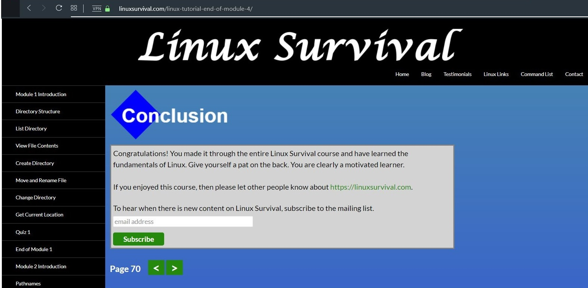

# kottans-backend
Finished first task. 

## Unix Shell

Finally done Unix Shell part. There was some new commands, like for printing que control. I intend to use GUI instead. 

## Git Collaboration

 